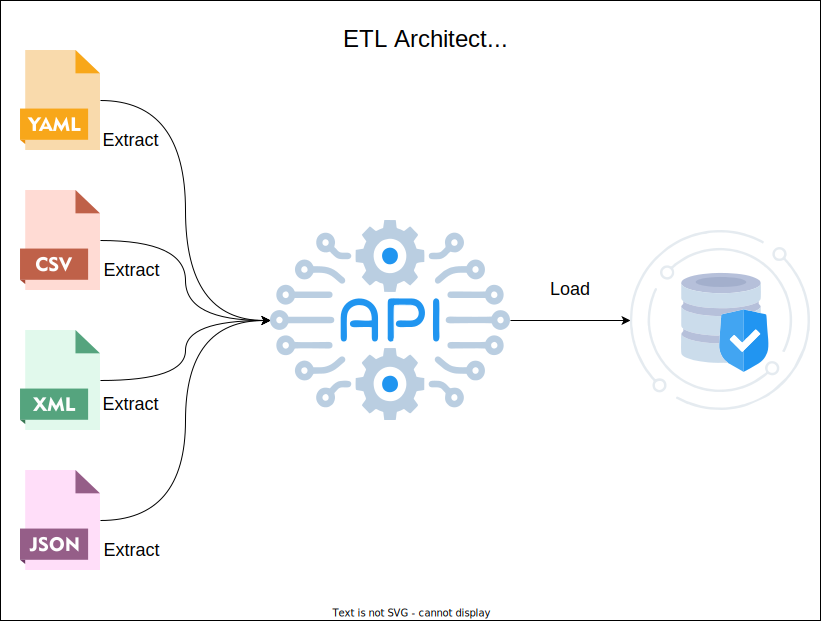

# Arquitetura Limpa #
A Arquitetura Limpa, proposta por Robert C. Martin, é uma abordagem que busca criar sistemas de software bem estruturados, flexíveis e de fácil manutenção. Ela enfatiza a separação de preocupações, a independência de frameworks externos e a priorização da lógica de negócios sobre as implementações tecnológicas. Ao seguir os princípios da Arquitetura Limpa, os desenvolvedores podem criar sistemas mais escaláveis, testáveis e sustentáveis ao longo do tempo.

# Motivação #

A motivação por trás da criação deste projeto surge de questões comuns e desafios enfrentados por arquitetos e líderes de equipe ao considerar a adoção dos princípios da Arquitetura Limpa.

### Desafios Iniciais

Um dos questionamentos frequentes é o custo e a complexidade associados à implementação inicial de uma arquitetura limpa em projetos. A proposta de quatro camadas pode gerar dúvidas sobre a quantidade de código necessário desde o início e os esforços necessários para estabelecer uma estrutura robusta desde o início.

### Avaliação do Investimento

Há uma constante busca por compreender o retorno do investimento ao escolher a Arquitetura Limpa. Entender como essa arquitetura impacta a produtividade, manutenção e escalabilidade, especialmente nos estágios iniciais do projeto, é parte integrante da motivação por trás desta iniciativa.

### Conhecimento Prévio Necessário

Outro ponto relevante é entender o quanto de conhecimento inicial uma equipe de desenvolvedores e testadores precisa ter sobre a Arquitetura Limpa para aplicá-la com sucesso. Isso inclui avaliar a curva de aprendizado, os recursos de treinamento necessários e como integrar novos membros à equipe de maneira eficaz.

### Validando na Prática

A decisão de criar este projeto foi uma imposição que me coloquei, uma oportunidade pessoal para explorar essas e outras questões na prática. Ao enfrentar esses desafios com uma abordagem hands-on, buscava obter insights valiosos sobre os benefícios, desafios e nuances associados à adoção da Arquitetura Limpa em um contexto real.


# Sobre o Projeto #
Este projeto representa uma aplicação de backend de natureza tradicional, seguindo o modelo comum de um servidor que interage com o mundo exterior por meio de uma REST API e se conecta a uma base de dados para acessar e persistir informações. A escolha deliberada por esse modelo tradicional reflete a intenção de aplicar os princípios da Arquitetura Limpa em um cenário amplamente reconhecido e compreendido.

A imagem abaixo ilustra o contexto hipotético de infraestrutura onde essa aplicação estaria inserida:


O ponto focal deste projeto é a introdução de um endpoint específico para a inclusão de itens em registros de lote, uma funcionalidade que transcende o tradicional CRUD. Essa escolha acrescenta uma camada de complexidade, envolvendo o upload e processamento de arquivos, o que proporciona um desafio maior e, ao mesmo tempo, uma oportunidade para a aplicação de design patterns mais elaborados.

Além disso, é importante destacar que este serviço possui características de uma aplicação ETL (Extract, Transform, Load). A capacidade de extrair informações de arquivos, realizar transformações conforme necessário e carregar dados em lotes adiciona uma dimensão única ao projeto. Essa abordagem ETL reforça a aplicação prática dos princípios da Arquitetura Limpa em um contexto específico, ampliando a compreensão sobre como esses princípios podem ser adaptados para atender a necessidades complexas.



Ao abordar essa funcionalidade menos comum, o projeto visa não apenas motivar a aplicação dos princípios da Arquitetura Limpa, mas também demonstrar como esses princípios podem ser adaptados e estendidos para resolver desafios específicos, como o processamento de arquivos em lotes.


## Requisitos ##
O projeto é uma aplicação escrita em Python que oferece uma REST API voltada para transações financeiras, projetada para ser hospedada no GCP (Google Cloud Platform) e executar via App Engine.<br>
Abaixo estão listadas as tecnologias adotadas e as ferramentas necessárias para execução e manutenção do projeto.
  - Python 3.10+
  - docker (opcional)
  - docker-compose (opcional)
  -

### Bibliotecas ###
Internamente o projeto faz uso das seguintes bibliotecas:<br>
  - google-cloud-datastore 2.10.x
  - google-cloud-loggin 3.2.x
  - google-cloud-tasks 2.10.x
  - FastApi 0.88.x
  - pydantic
  - python-dotenv
  - requests
  - uvicorn


# Estrutura de diretório #

A estrutura de diretórios adotará os conceitos e limites especificados pela `Arquitetura Limpa`, dividindo a aplicação em quatro camadas principais:
- Frameworks & Drivers
- Interface Adapters
- Application Business Rules
- Enterprise Business Rules


Todo o código fonte responsável pela execução da aplicação está localizado dentro do diretório `/app`, estruturado para manter segregadas as interfaces, os adaptadores e as regras de negócios de acordo com a natureza de cada componente.
A estrutura de diretório adotada é a seguinte:

```
./
├── app/
│   ├── domain/
│   │   ├── data_models/
│   │   │   └── ...
│   │   ├── entities/
│   │   │   └── ...
│   │   ├── usecases/
│   │   │   └── ...
│   │   ├── validations/
│   │   │   └── ...
│   ├── infrastructure/
│   │   ├── database/
│   │   │   └── ...
│   │   └── ...
│   ├── main/
│   │   ├── factories/
│   │   │   └── ...
│   │   ├── rest/
│   │   │   └── ...
│   ├── services/
│   │   ├── mappers/
│   │   │   └── ...
│   │   ├── repositories/
│   │   │   └── ...
│   │   ├── rest/
│   │   │   └── ...
│   │   ├── usecases/
│   │   │   └── ...
│   │   ├── utils/
│   │   │   └── ...
│   │   └── main.py
├── docs/
│   ├── swagger/
│   │   └── ...
│   ├── diagrams/
│   │   └── ...
│   └── ...
├── tests/
```

## Enterprise & Application Business Rules ##
As duas camadas mais internas propostas na arquitetura limpa estão essencialmente localizadas em dois locais:<br>
As camadas mais internas propostas na Arquitetura Limpa são essencialmente organizadas em dois locais:
- /app/domain; e
- /app/services/usecases

#### `/app/domain`
O diretório `/app/domain` abriga as interfaces, classes abstratas e estruturas de dados que definem as regras de negócio tanto para esta aplicação quanto para aquelas que podem ser comuns a outras áreas ou setores da empresa. As classes nesse local são abstrações com uma implementação mínima, sendo predominantemente interfaces que determinam a estrutura dos `Use Cases` em termos de entradas e saídas.

#### `/app/services/usecases`

O diretório `/app/services/usecases` contém as implementações concretas de cada `Use Case` cuja abstração é especificada em `/app/domain`. As implementações dos `Use Cases` geralmente seguem um design pattern do tipo `Strategy`. Cada `Use Case` possui um método principal chamado `run()`, que determina o fluxo de execução geral. Além disso, fazem uso de injeção de dependências para configurar o comportamento de algumas ações dentro desse fluxo de execução.

Um exemplo comum encontrado na maioria dos casos de uso é a operação de carregamento e/ou persistência de informações no banco de dados. A ação de carregar ou persistir os dados é gerenciada por um objeto específico que é injetado durante a preparação e inicialização do `Use Case`.


## Interface Adapters ##
Cada driver, biblioteca, framework ou componente externo utilizado pela aplicação possui uma camada de abstração e uma camada de implementação específica, conhecida como um adapter. A finalidade fundamental desses adapters é manter um limite claro entre a camada externa e as camadas mais internas da aplicação.

#### Estrutura de Diretório

As interfaces e classes abstratas de cada adapter estão organizadas em pastas específicas, com nomes apropriados ao tipo de tecnologia, a partir do diretório `/app/services/`. Por exemplo, para um adapter relacionado a serviços REST, as interfaces e abstrações podem ser encontradas em `/app/services/rest`. Da mesma forma, para outros tipos de tecnologias, o diretório específico reflete o contexto do adapter.

As implementações dos respectivos adapters geralmente estão distribuídas da seguinte forma:
- Para requisições REST: `/app/main`
- Para outros adapters de infraestrutura: `/app/infrastructure/`

Essa organização permite uma separação clara entre as interfaces que definem a interação com componentes externos e as implementações que concretizam essas interações, seguindo os princípios da Arquitetura Limpa.


## Componente Main ##
Dentro do contexto da nossa aplicação, o componente principal é a API REST. Nossa aplicação é um servidor que oferece uma API financeira como serviço. Esse componente é responsável por receber requisições, processá-las e devolver as respostas correspondentes.

#### Papel Fundamental

A API REST desempenha um papel central, sendo a entrada para a aplicação e exercendo funções críticas na orquestração e supervisão das demais camadas. Suas responsabilidades incluem:
- Receber e interpretar as requisições vindas do mundo exterior.
- Criar instâncias dos `Use Cases` adequados para processar essas requisições.
- Orquestrar a execução dos `Use Cases`, garantindo que as regras de negócio sejam seguidas.
- Coletar e validar as saídas dos `Use Cases`.
- Gerar respostas apropriadas para as requisições, formatando-as de acordo com os padrões da API REST.

Essa centralidade do componente Main destaca sua importância na execução harmoniosa de toda a aplicação, seguindo os princípios da Arquitetura Limpa.

### REST API ###

A principal porta de entrada da aplicação são requisições REST implementadas através da biblioteca FastAPI.<br>
Essas requisições contam com `models`, `controllers`, `exceptions`, `services`, `config` e `adapters`.

```
app/
├── main/
│   ├── rest/
│   │   ├── adapters/
│   │   │   └── fastapi_adapter.py
│   │   ├── config/
│   │   │   └── ...
│   │   ├── controllers/
│   │   │   └── ...
│   │   ├── exceptions/
│   │   │   └── ...
│   │   ├── mappers/
│   │   │   └── ...
│   │   ├── models/
│   │   │   └── ...
│   │   ├── services/
│   │   │   └── ...
│   │   └── main.py
```
#### REST API Adapters
O diretório `/app/main/rest/adapters` contém adaptadores utilizados pelos endpoints para padronizar e abstrair questões relacionadas à biblioteca REST.<br>
As implementações concretas para abstrações relacionadas a objetos como `Request`, `Response`, `Body`, `Header`, `FormData`, `Query`, `Url`, entre outros, são encontradas nesse diretório. Esses adaptadores oferecem uma camada de abstração sobre a biblioteca ou framework utilizado, garantindo transparência e uniformidade no acesso e manipulação dos dados das requisições.

#### REST API Config
O diretório `/app/main/rest/config` contém arquivos e métodos que facilitam a preparação e inicialização do servidor REST de acordo com a biblioteca REST utilizada.

#### REST API Controllers
O diretório `/app/main/rest/controllers` é o ponto inicial que acomoda os `routers` e `controllers` de cada endpoint da API.<br>
A estrutura de subdiretórios adota os mesmos níveis dos endpoints, facilitando a identificação do arquivo que contém o controlador de um endpoint específico.

#### REST API Exceptions
O diretório `/app/main/rest/exceptions` pode conter classes de exceção personalizadas lançadas em casos específicos durante o processamento das requisições REST, gerenciando erros de forma mais granular e oferecendo respostas adequadas.

#### REST API Mapppers
No diretório `/app/main/rest/mappers`, os mappers são classes com a responsabilidade única de converter os dados recebidos nas requisições REST para uma estrutura de dados única e sem as particularidades do padrão REST. Essa conversão é essencial para harmonizar os dados antes de serem processados pelas camadas mais internas.

#### REST API Models ###
O diretório `/app/main/rest/models` contém as `models`, ou seja, os modelos de dados que representam a estrutura das solicitações e das respostas. Essas models fazem uso da biblioteca `pydantic` para definir estruturas de dados com regras de formatação, restrições, obrigatoriedades, limites e padrões que devem ser respeitados nas requisições da API.

#### REST API Services
No diretório `/app/main/rest/services`, estão as classes responsáveis pela validação das requisições e outras ações básicas relacionadas especificamente à API, sem se ater ao processamento das transações.

### Considerações sobre os Adapters ###
Ao utilizar o FastAPI para sustentar o servidor API REST, a aplicação adota uma abordagem que minimiza o acoplamento, prevenindo possíveis complicações em futuros upgrades ou substituições do framework. Para alcançar essa flexibilidade, é implementada uma pequena camada de abstração e classes que funcionam como adaptadores, proporcionando um acesso transparente aos dados da requisição e padronizando a forma como as respostas são retornadas.

As classes que servem como interfaces para esse adaptador encontram-se em `/service/rest/`, enquanto a implementação concreta do ou dos adaptadores está localizada em `/app/main/rest/adapters`.

Além disso, considerando que requisições REST são apenas um método de comunicação e um meio de entrada de dados na aplicação, foi introduzida uma camada adicional para traduzir estruturas de dados. Essa tradução é realizada por classes do tipo mappers, localizadas em `/app/main/rest/mappers`. A finalidade dessas classes é converter os dados recebidos em uma requisição REST para uma estrutura única, conhecida pelos `Use Cases`.

#### Mapper para Comunicação Assíncrona
Antecipando uma possível evolução da aplicação para receber requisições por outros métodos, como filas por meio de um sistema de mensageria Pub/Sub, os `mappers` desempenham um papel crucial. Essas classes abstraem as particularidades de cada meio de comunicação, oferecendo à camada de regra de negócio uma estrutura de dados consistente. Enquanto uma requisição REST pode conter dados distribuídos na `URL`, via `query param` ou `path param`, no `header` e no corpo da requisição, um evento recebido por mensageria normalmente tem o nome da fila e o corpo da mensagem como locais para acomodar uma solicitação.<br>
Os mappers tornam a comunicação uniforme, independentemente do canal, protocolo ou formato de dados utilizado.


## Database ##
De maneira análoga às requisições REST, a persistência e recuperação dos dados armazenados no banco de dados seguem os princípios da Arquitetura Limpa, mantendo uma camada de abstração entre o banco de dados e as regras de negócio.

A camada de domínio permanece independente do tipo de banco de dados, dos drivers, das estruturas internas, dos tipos de campos, dos relacionamentos, dos índices, dos métodos de acesso, da conexão, da autenticação e permissões de acesso, e outros detalhes específicos do banco de dados utilizado.

Dentro da estrutura de diretórios, a base de dados está dividida da seguinte forma:
```
app/
├── domain/
│   ├── data_models/
│   |   └── ...
│   ├── entities/
│   |   └── ...
├── services/
│   ├── mappers/
│   │   ├── repositories/
│   │   │   └── ...
│   ├── repositories/
│   │   ├── contract/
│   │   │   └── ...
│   │   ├── repo_models/
│   │   │   └── ...
├── infrastructure/
│   ├── database/
│   │   ├── gcp_datastore/
│   │   │   ├── config/
│   │   │   │   └── ...
│   │   │   ├── <schema>/
│   │   │   │   └── ...
```

### Modelos de dados da camada Domain ###
Antes de explorar os modelos de dados usados para representar as tabelas e outros tipos de entidades nos bancos de dados, é essencial compreender as `data models`. Uma `data model` é uma representação estruturada e abstrata das informações e relacionamentos em um sistema, sendo uma visão independente de particularidades específicas de serviços de armazenamento ou objetos de transferência de dados (DTOs), como os usados em APIs REST.

Os modelos de dados contidos no diretório `/app/domain/data_models` são representações lógicas dos dados processados pelos `Use Cases`. Diferentemente das entities em `/app/domain/entities`, esses modelos são abstrações mais internas, destinadas a atender exclusivamente às regras de negócio, sem considerar detalhes de camadas externas.

### Modelos de dados dos repositórios ###
Cada banco de dados ou serviço de armazenamento tem seu próprio ecossistema, resultando em diferentes representações de estruturas de dados e entidades. Para lidar com essa diversidade, modelos de dados específicos do banco ou serviço são organizados no diretório `/app/infrastructure/database/`, enquanto modelos de dados mais abstratos são mantidos em `/app/services/repositories/repo_models`. Esses modelos abstratos são estruturas frequentemente usadas em operações de leitura ou escrita, sem dependerem diretamente de bibliotecas ou drivers específicos.

### Contracts ###
Os `repository contracts` são classes abstratas utilizadas para generalizar operações de leitura e escrita realizadas pelos `Use Cases`. Estas classes agem como interfaces, especificando para a camada externa (infraestrutura/database) as operações suportadas, juntamente com os dados de entrada e saída dessas operações.

### Mappers ###
No diretório `/app/services/mappers/repositories`, encontram-se as classes do tipo mapper ou transformer. Essas classes são responsáveis por converter estruturas de dados específicas da camada de banco de dados em estruturas de dados da camada de regras de negócio (`data models`) e vice-versa. Essa abordagem elimina a dependência de bibliotecas de terceiros na camada de regras de negócio, seguindo o princípio `SRP` (Single Responsibility Principle) do SOLID.


### Infrastructure ###
Dentro do diretório `/app/infrastructure/database/gcp_datastore`, estão as classes que implementam as interfaces de contrato dos repositórios, atuando como adaptadores para o Firestore em Datastore mode, a base de dados inicialmente adotada pela aplicação. Cada repositório possui seu adaptador correspondente, conhecendo a conexão ao Datastore, o esquema/dataset/entidade onde os dados são armazenados e outros aspectos específicos desse serviço de armazenamento. A estrutura de subdiretórios reflete a organização de schemas e namespaces utilizada no Cloud Storage.
